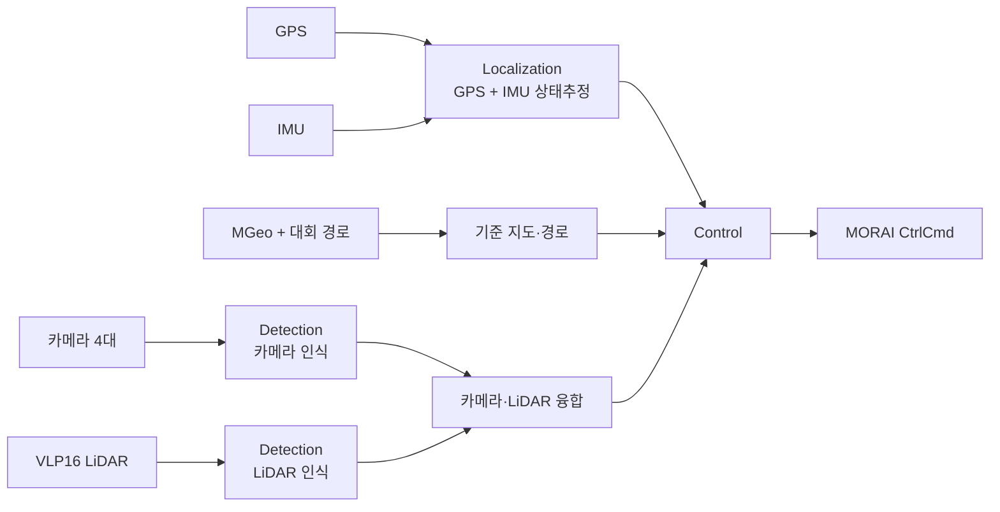

# MORAI 통합 작업공간

이 폴더를 앞으로 사용하는 단일 기준 저장소로 정합니다. 기존 `ros_ws*`,
`run+camera`, `running` 폴더의 코드는 정리 대상이며, 필요한 개념과 설정은
이 폴더의 문서로만 관리합니다.

현재 폴더 구성, 실행 순서, 토픽 연결, 테스트 기준은
[현재 구성 및 실행 보고서](docs/현재_구성_및_실행_보고서.md)를 먼저 읽습니다.

## 고정된 카메라 포트

| 센서 | MORAI Host Sensor Port | Ubuntu Destination Port |
|---|---:|---:|
| 전방 카메라 | 1100 | 1101 |
| 좌측 카메라 | 1110 | 1111 |
| 우측 카메라 | 1120 | 1121 |
| 네 번째 카메라 | 1130 | 1131 |

ROS 네이티브 운용의 공식 입력은 다음과 같습니다.

| 센서·기능 | MORAI ROS 토픽 | 메시지 타입 |
|---|---|---|
| GPS | /gps | morai_msgs/GPSMessage |
| IMU | /Imu | sensor_msgs/Imu |
| 차량 상태 검증 | /Ego_topic | morai_msgs/EgoVehicleStatus |
| 3D LiDAR | /lidar3D | sensor_msgs/PointCloud2 |
| 카메라 | 센서별 고유 topic | sensor_msgs/CompressedImage |
| 제어 | /ctrl_cmd | morai_msgs/CtrlCmd |

기존 카메라 포트와 VLP16 LiDAR `2000 → 2001`, GPS `3001`, IMU `4001`,
CtrlCmd `Ubuntu 9094 → MORAI 9093`은 ROS 네이티브 연결이 불가능한 경우의
UDP fallback 계약입니다.

IP 주소는 코드에 고정하지 않습니다. MORAI PC와 Ubuntu 알고리즘 PC의 실제
주소를 실행 전에 확인하고 [sensor_ports.yaml](config/sensor_ports.yaml)에
기록합니다.

ROS 토픽 기준은 [MORAI ROS 토픽 계약](docs/MORAI_ROS_토픽_계약.md)과
[ros_topics.yaml](config/ros_topics.yaml)에서 관리합니다.
기록·재생은 [ROS 기록·재생 설계](docs/ROS_기록_재생_설계.md),
GPS 정렬 실험은 [좌표정렬 실행절차](docs/좌표정렬_실행절차.md)를 따릅니다.

## 전체 구조

```text
morai_ws/
├─ src/
│  ├─ localization/    GPS·IMU·좌표변환·상태추정
│  ├─ control/         MGeo·경로·제어·CtrlCmd
│  ├─ detection/       카메라·LiDAR·인식·센서융합
│  └─ common/          공통 메시지와 테스트 도구
├─ config/             모든 공통 설정
├─ data/               경로·MGeo·대회 참고자료
├─ docs/               분석과 팀 간 계약
└─ 각 package/launch/  패키지별 실행 파일
```

## 센서 융합 원칙



- GPS와 IMU는 `localization`에서 먼저 융합합니다.
- 카메라와 LiDAR는 각 센서 단독 검증 후 `detection`에서 융합합니다.
- MGeo는 센서 측정값이 아니라 지도와 경로의 기준입니다.
- 조향·가속·제동 명령은 `control`만 발행합니다.

## 팀별 책임

- `src/localization`: GPS/IMU UDP, 시간 동기화, ENU 변환, 상태추정,
  `map → base_link` 변환
- `src/control`: MGeo 해석, 대회 경로 관리, 경로추종, 속도·조향,
  CtrlCmd 송신
- `src/detection`: 카메라 4대와 LiDAR 수신, 보정, 차선·신호·장애물,
  카메라·LiDAR 융합, 안전정지 요청
- `src/common`: 공통 메시지, frame 이름, 단위, 진단 형식

새로운 패키지나 토픽을 만들기 전에 [팀 간 인터페이스 계약](docs/INTERFACE_CONTRACT.md)과
[이관 계획](docs/MIGRATION_PLAN.md), [세부 규정집 요약](docs/세부규정집_요약.md)을
확인합니다.

## 현재 권장 실행 순서

1. `localization_purepursuit.launch`를 `enable_control=false`로 실행해 GPS·IMU·EKF를 확인한다.
2. 실제 `/localization/odometry`를 입력으로 `curvature_speed_purepursuit_noisy.launch`를
   `publish_command=false`로 실행한다.
3. 카메라·LiDAR·안전정지·control mux를 `perception_control_bringup.launch`에서 확인한다.
4. 모든 검증이 끝난 뒤에만 실제 MORAI 제어 명령을 연결한다.

기존 Pure Pursuit와 새 곡률 기반 Pure Pursuit를 동시에 실행하지 않습니다. 새 실험은
`/experimental/*` 토픽을 사용하고, 기존 주행은 `/ctrl_cmd` 체계를 사용합니다.
